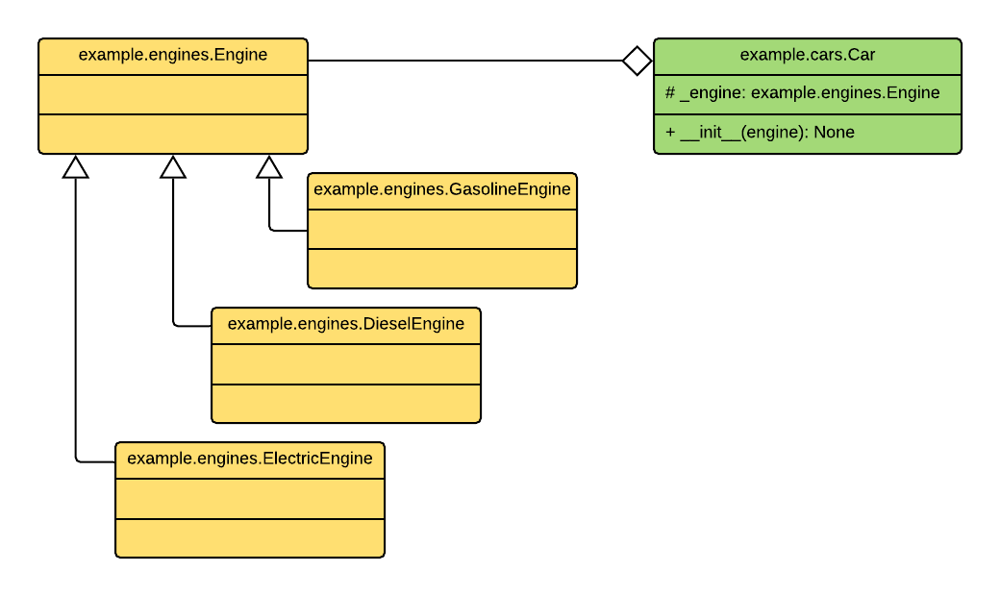

# 파이썬에서 의존성 삽입과 제어의 역전에 대해

원문 편역 : <http://python-dependency-injector.ets-labs.org/introduction/di_in_python.html>

## History

* 원래 의존성 주입 패턴은 Java와 같은 정적 입력을 사용하는 언어에서 널리 사용되었다.
* 의존성 주입 프레임 워크는 정적 타이핑으로 언어의 유연성을 크게 향상시킬 수 있습니다.
* 정적 입력을 사용하여 언어에 대한 종속성 주입 프레임 워크를 구현하는 것은 쉬운 일이 아니며 잘 하려면 매우 복잡한 과정을 거쳐야 한다.
* 반면 파이썬과 같이 동적 타입을 사용하는 언어는 자바처럼 의존성 주입을 구현하기 위해 복잡한 장치를 사용할 필요가 없다. 언어 자체가 의존성 주입을 쉽게 할 수 있도록 설계 되어 있다.

## 논의

사실이다.

부부적으로

Dependency injection, as a software design pattern, has number of advantages that are common for each language (including Python):

Dependency Injection decreases coupling between a class and its dependency.
Because dependency injection doesn’t require any change in code behavior it can be applied to legacy code as a refactoring. The result is clients that are more independent and that are easier to unit test in isolation using stubs or mock objects that simulate other objects not under test. This ease of testing is often the first benefit noticed when using dependency injection.
Dependency injection can be used to externalize a system’s configuration details into configuration files allowing the system to be reconfigured without recompilation (rebuilding). Separate configurations can be written for different situations that require different implementations of components. This includes, but is not limited to, testing.
Reduction of boilerplate code in the application objects since all work to initialize or set up dependencies is handled by a provider component.
Dependency injection allows a client to remove all knowledge of a concrete implementation that it needs to use. This helps isolate the client from the impact of design changes and defects. It promotes reusability, testability and maintainability.
Dependency injection allows a client the flexibility of being configurable. Only the client’s behavior is fixed. The client may act on anything that supports the intrinsic interface the client expects.
Note

While improved testability is one the first benefits of using dependency injection, 
it could be easily overwhelmed by monkey-patching technique, 
that works absolutely great in Python (you can monkey-patch anything, anytime). 
At the same time, monkey-patching has nothing similar with other advantages defined above. 
Also monkey-patching technique is something that could be considered like 
too dirty to be used in production.


파이썬은 동적 타입을 지원하기 때문에 다른 여타의 언어보다 의존성 삽입을 훨씬 쉽게 구현할 수 있다.

```text
파이썬에서 의존성의 주입이 복잡하지 않다는 말은 곧
일부 코드에 대해서는 작성후 잘 검토 하고, 테스트 코드를 강화해야 한다는
의미이기도 하다.
```
Note

Low complexity of dependency injection pattern implementation in Python still means that some code should be written, reviewed, tested and supported.

제어 역전에 관해 말하면, 그것은 타이핑 유형에 의존하지 않고 각 프로그래밍 언어에서도 작동하는 소프트웨어 설계 원칙입니다.

제어의 반전은 프로그램의 모듈성을 높이고 확장 가능하게 만드는 데 사용됩니다.

제어 반전을 사용하는 주요 설계 목적은 다음과 같습니다.

작업 실행을 구현에서 분리합니다.
모듈을 설계된 작업에 중점을 둡니다.
다른 시스템이 수행하는 방식에 대한 가정에서 모듈을 해방하고 대신 계약에 의존합니다.
모듈 교체시 부작용을 방지합니다.

다음의 예를 살펴 보자.



example.engines 모듈 리스트

```python
example2


class Engine:
    """Example engine base class.

    Engine is a heart of every car. Engine is a very common term and could be
    implemented in very different ways.
    """


class GasolineEngine(Engine):
    """Gasoline engine."""


class DieselEngine(Engine):
    """Diesel engine."""


class ElectricEngine(Engine):
    """Electric engine."""
```

example.cars 모듈의 리스트

```python
example2


class Car:
    """Example car."""

    def __init__(self, engine):
        """Initialize instance."""
        self._engine = engine  # Engine is injected
```
        
다음 예제는 엔진이 다른 여러 자동차를 만드는 방법을 보여줍니다.

```python
"""Dependency injection example, Cars & Engines."""

import example.cars
import example.engines


if __name__ == '__main__':
    gasoline_car = example.cars.Car(example.engines.GasolineEngine())
    diesel_car = example.cars.Car(example.engines.DieselEngine())
    electric_car = example.cars.Car(example.engines.ElectricEngine())
```

이전 예제는 의존성 삽입의 장점을 설명하고 있지만, 특정 타입의 자동차를 생성해서 넣어주어야 하는 등의 번잡한 코드가 추가 된다는
단저도 있습니다. 그럼에도 불구하고 이런 단점음 프레임워크나 컨테이너 기술을 이용해 극복할 수 있습니다.

다음은 컨테이너 기술을 이용한 방법 입니다.

```python

import example.cars
import example.engines

import dependency_injector.containers as containers
import dependency_injector.providers as providers


class Engines(containers.DeclarativeContainer):
    """IoC container of engine providers."""

    gasoline = providers.Factory(example.engines.GasolineEngine)

    diesel = providers.Factory(example.engines.DieselEngine)

    electric = providers.Factory(example.engines.ElectricEngine)


class Cars(containers.DeclarativeContainer):
    """IoC container of car providers."""

    gasoline = providers.Factory(example.cars.Car,
                                 engine=Engines.gasoline)

    diesel = providers.Factory(example.cars.Car,
                               engine=Engines.diesel)

    electric = providers.Factory(example.cars.Car,
                                 engine=Engines.electric)


if __name__ == '__main__':
    gasoline_car = Cars.gasoline()
    diesel_car = Cars.diesel()
    electric_car = Cars.electric()

```

    
기타 유용한 자료
* <https://en.wikipedia.org/wiki/Dependency_injection>
* <https://martinfowler.com/articles/injection.html>
* <https://github.com/ets-labs/python-dependency-injector>
* <https://pypi.org/project/dependency-injector/>